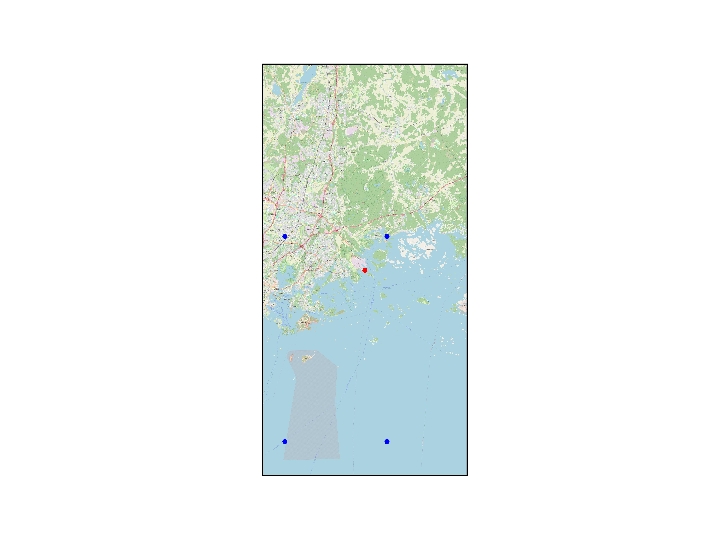

## Training locations 

Helsinki Vuosaari harbor FMISID 151028 lat 60.20867 long 25.2959

training latitudes [60.2500000 60.2500000 60.0000000 60.0000000]

training longitudes [25.0000000 25.2500000 25.0000000 25.2500000]

## Predictand data

| Predictand | Units | Producer |  ML name |
| ------------- |---|:-------------:|-:|
| Average wind speed, 1 hour| m/s |  |WS_PT1H_AVG |
|Maximum wind speed, 1 hour |m/s||WG_PT1H_MAX|

## Predictors for fitting the ML model

| Predictor | Units | Producer | Spatial resolution | Temporal resolution | ML name |
| ------------- |---|:-------------:| --:|-:|-:|
| 10m u-component of wind | m/s |ERA5|0.25° x 0.25°|hourly data, 3h steps starting 00 UTC|u10|
| 10m v-component of wind | m/s |ERA5|0.25° x 0.25°||v10|
| 10m wind gust since previous post-processing  | m/s |ERA5|0.25° x 0.25°||fg10|
|2m dewpoint temperature|K|ERA5|0.25° x 0.25°||td2|
|2m temperature|K|ERA5|0.25° x 0.25°||t2|
|Eastward turbulent surface stress|N m-2 s|ERA5|0.25° x 0.25°||ewss|
|Evaporation|m of water equivalent|ERA5|0.25° x 0.25°||e|
|Land-sea mask|-|ERA5|0.25° x 0.25°||lsm|
|Mean sea level pressure|Pa|ERA5|0.25° x 0.25°||msl|
|Northward turbulent surface stress|N m-2 s|ERA5|0.25° x 0.25°||nsss|
|Sea surface temperature|K|ERA5|0.25° x 0.25°||tsea|
|Surface latent heat flux|W m-2|ERA5|0.25° x 0.25°||slhf|
|Surface net solar radiation|W m-2|ERA5|0.25° x 0.25°||ssr|
|Surface net thermal radiation|W m-2|ERA5|0.25° x 0.25°||str|
|Surface sensible heat flux|W m-2|ERA5|0.25° x 0.25°||sshf|
|Surface solar radiation downwards|W m-2|ERA5|0.25° x 0.25°||ssrd|
|Surface thermal radiation downwards|W m-2|ERA5|0.25° x 0.25°||strd|
|Total cloud cover|0 to 1|ERA5|0.25° x 0.25°||tcc|
|Total column cloud liquid water|kg m-2|ERA5|0.25° x 0.25°||tclw|
|Total precipitation|m|ERA5|0.25° x 0.25°||tp|

## Predictors for predicting with seasonal forecast

| Predictor | Units | Producer | Spatial resolution | Temporal resolution | ML name |
| ------------- |---|:-------------:| --:|-:|-:|
| 10m u-component of wind | m/s ||||u10|
| 10m v-component of wind | m/s ||||v10|
| 10m wind gust since previous post-processing  | m/s ||||
|2m dewpoint temperature|K||||td2|
|2m temperature|K||||t2|
|Eastward turbulent surface stress|N m-2 s||||
|Evaporation|m of water equivalent||||
|Land-sea mask|-||||lsm|
|Mean sea level pressure|Pa||||
|Northward turbulent surface stress|N m-2 s||||
|Sea surface temperature|K||||
|Surface latent heat flux|W m-2||||
|Surface net solar radiation|W m-2||||
|Surface net thermal radiation|W m-2||||
|Surface sensible heat flux|W m-2||||
|Surface solar radiation downwards|W m-2||||
|Surface thermal radiation downwards|W m-2||||
|Total cloud cover|0 to 1||||
|Total column cloud liquid water|kg m-2||||
|Total precipitation|m||||

