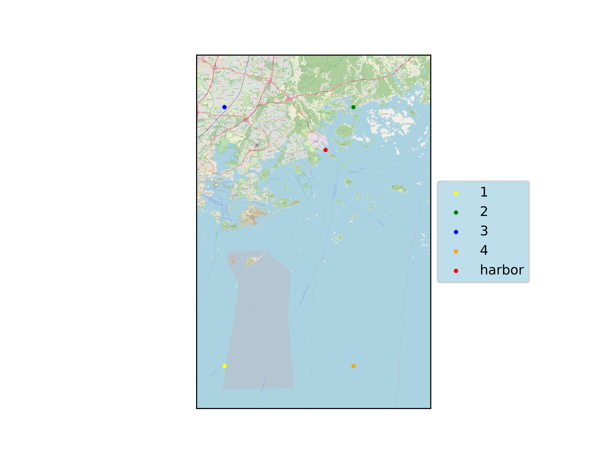

## Training locations 

Helsinki Vuosaari harbor: FMISID 151028 latitude 60.20867 longitude 25.2959

### Training latitudes
Closest to harbor ERA5 grid points in Table 1.
|lat name|lon name|lat deg|lon deg|
|:-:|:-:|:--:|:--:|
|lat-1 |lon-1 |60.00 |25.00|
lat-2 |lon-2 |60.25 |25.25|
lat-3 |lon-3 |60.25 |25.00|
lat-4 |lon-4 |60.00| 25.25|

Table 1 Training locations and their ML names.

Figure 1 Training locations and Helsinki Vuosaari harbor measuring site.

## Data 
Fitting period 2013-2023, predictors and predictand daily values.
### Predictand data

| Predictand | Units | Producer |Temporal resolution|  ML name |
| :------------- |:---|:-----------|:--|:-|
| Average wind speed, 1 hour| m/s |daily mean from hourly data|WS_PT1H_AVG |
|Maximum wind speed, 1 hour |m/s|previous day maximum value from hourly data|WG_PT1H_MAX|

### Predictors for fitting the ML model 
ERA5 data available hourly. 
| Predictor | Units | Producer | Spatial resolution |ML Temporal resolution | ML name |
| :------------- |:---|:-------------|:--|:-|:-|
| 10m u-component of wind | m/s |ERA5|0.25° x 0.25°|00 UTC|u10|
| 10m v-component of wind | m/s |ERA5|0.25° x 0.25°|00 UTC|v10|
| 10m wind gust since previous post-processing  | m/s |ERA5|0.25° x 0.25°|previous day maximum value|fg10|
|2m dewpoint temperature|K|ERA5|0.25° x 0.25°|00 UTC|td2|
|2m temperature|K|ERA5|0.25° x 0.25°|00 UTC|t2|
|Eastward turbulent surface stress|N m-2 s|ERA5|0.25° x 0.25°|previous day 24h sums|ewss|
|Evaporation|m of water equivalent|ERA5|0.25° x 0.25°|previous day 24h sums|e|
|Land-sea mask|-|ERA5|0.25° x 0.25°|static|lsm|
|Mean sea level pressure|Pa|ERA5|0.25° x 0.25°|00 UTC|msl|
|Northward turbulent surface stress|N m-2 s|ERA5|0.25° x 0.25°|previous day 24h sums|nsss|
|Sea surface temperature|K|ERA5|0.25° x 0.25°|00 UTC|tsea|
|Surface latent heat flux|W m-2|ERA5|0.25° x 0.25°|previous day 24h sums|slhf|
|Surface net solar radiation|W m-2|ERA5|0.25° x 0.25°|previous day 24h sums|ssr|
|Surface net thermal radiation|W m-2|ERA5|0.25° x 0.25°|previous day 24h sums|str|
|Surface sensible heat flux|W m-2|ERA5|0.25° x 0.25°|previous day 24h sums|sshf|
|Surface solar radiation downwards|W m-2|ERA5|0.25° x 0.25°|previous day 24h sums|ssrd|
|Surface thermal radiation downwards|W m-2|ERA5|0.25° x 0.25°|previous day 24h sums|strd|
|Total cloud cover|0 to 1|ERA5|0.25° x 0.25°|00 UTC|tcc|
|Total column cloud liquid water|kg m-2|ERA5|0.25° x 0.25°|00 UTC|tclw|
|Total precipitation|m|ERA5|0.25° x 0.25°|previous day 24h sums|tp|

### Predictors for predicting with seasonal forecast

| Predictor | Units | Producer | Spatial resolution | ML Temporal resolution (available SF resolution) | ML name |
| :------------- |:---|:-------------| :--|:-|:-|
| 10m u-component of wind | m/s |||00 UTC (6h instantaneous)|u10|
| 10m v-component of wind | m/s |||00 UTC 6h instantaneous|v10|
| 10m wind gust since previous post-processing  | m/s |||previous day maximum value (24h aggregation)|fg10|
|2m dewpoint temperature|K|||00 UTC (6h instantaneous)|td2|
|2m temperature|K|||00 UTC (6h instantaneous)|t2|
|Eastward turbulent surface stress|N m-2 s|||previous day 24h sums (24h aggregation since beginning of forecast)|ewss|
|Evaporation|m of water equivalent|||previous day 24h sums (24h aggregation since beginning of forecast)|e|
|Land-sea mask|-|||static|lsm|
|Mean sea level pressure|Pa|||00 UTC (6h instantaneous)|msl|
|Northward turbulent surface stress|N m-2 s|||previous day 24h sums (24h aggregation since beginning of forecast)|nsss|
|Sea surface temperature|K|||00 UTC (6h instantaneous)|tsea|
|Surface latent heat flux|W m-2|||previous day 24h sums (24h aggregation since beginning of forecast)|slhf|
|Surface net solar radiation|W m-2|||previous day 24h sums (24h aggregation since beginning of forecast)|ssr|
|Surface net thermal radiation|W m-2|||previous day 24h sums (24h aggregation since beginning of forecast)|str|
|Surface sensible heat flux|W m-2|||previous day 24h sums (24h aggregation since beginning of forecast)|sshf|
|Surface solar radiation downwards|W m-2|||previous day 24h sums (24h aggregation since beginning of forecast)|ssrd|
|Surface thermal radiation downwards|W m-2|||previous day 24h sums (24h aggregation since beginning of forecast)|strd|
|Total cloud cover|0 to 1|||00 UTC (6h instantaneous)|tcc|
|Total column cloud liquid water|kg m-2|||00 UTC (24h instantaneous)|tlwc|
|Total precipitation|m|||previous day 24h sums (24h aggregation since beginning of forecast)|tp|

## KFold for SF WG_PT1H_MAX
Fold: 1 RMSE: 1.44
Train:  [2013 2015 2016 2017 2018 2019 2022 2023] Test:  [2014 2020 2021]

Fold: 2 RMSE: 1.46
Train:  [2014 2015 2016 2017 2019 2020 2021 2022 2023] Test:  [2013 2018]

Fold: 3 RMSE: 1.43
Train:  [2013 2014 2016 2017 2018 2020 2021 2022 2023] Test:  [2015 2019]

Fold: 4 RMSE: 1.57
Train:  [2013 2014 2015 2016 2018 2019 2020 2021 2022] Test:  [2017 2023]

Fold: 5 RMSE: 1.47
Train:  [2013 2014 2015 2017 2018 2019 2020 2021 2023] Test:  [2016 2022]

Best fold: 3. 
## KFold for testing with hourly ERA5 fitting
Fold: 1 RMSE: 1.02
Train:  [2013 2015 2016 2017 2018 2019 2022 2023] Test:  [2014 2020 2021]

Fold: 2 RMSE: 0.99
Train:  [2014 2015 2016 2017 2019 2020 2021 2022 2023] Test:  [2013 2018]

Fold: 3 RMSE: 1.03
Train:  [2013 2014 2016 2017 2018 2020 2021 2022 2023] Test:  [2015 2019]

Fold: 4 RMSE: 1.01
Train:  [2013 2014 2015 2016 2018 2019 2020 2021 2022] Test:  [2017 2023]

Fold: 5 RMSE: 0.98
Train:  [2013 2014 2015 2017 2018 2019 2020 2021 2023] Test:  [2016 2022]

Best fold: 5