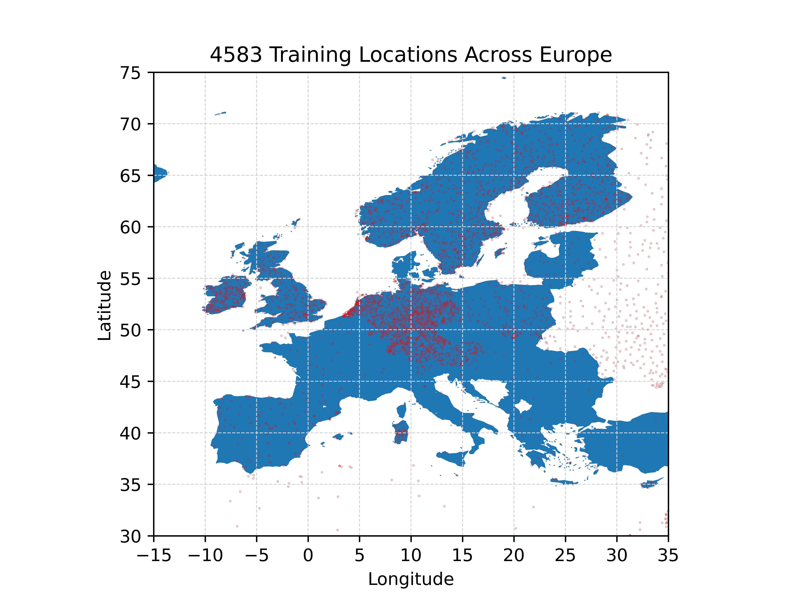

## Training locations 

Figure 1 From eobs with time series 2000-2020 

Figure 2 subset with less weight on previously crowded areas

## Data 
Fitting period 2000-2020, predictors and predictand daily values.
### Predictand data

Blended series of stations data. 

| Predictand | Units | Producer |Temporal resolution|  ML name |
| :------------- |:---|:-----------|:--|:-|
|Precipitation amount | 0.1 mm (m in ML) |EOBS|daily accumulations |RR|

### Predictors for fitting the ML model 
ERA5 data available hourly. 
| Predictor | Units | Producer | Spatial resolution |ML Temporal resolution | ML name |
| :------------- |:---|:-------------|:--|:-|:-|
| 10m u-component of wind | m/s |ERA5|0.25° x 0.25°|00 and 12 UTC|u10-00 u10-12|
| 10m v-component of wind | m/s |ERA5|0.25° x 0.25°|00 and 12 UTC|v10-00 v10-12|
| 10m wind gust since previous post-processing  | m/s |ERA5|0.25° x 0.25°|previous day maximum value|fg10|
|Maximum temperature  | K |ERA5|0.25° x 0.25°|previous day maximum value|mx2t|
|Minimum temperature  | K |ERA5|0.25° x 0.25°|previous day minimum value|mn2t|
|2m dewpoint temperature|K|ERA5|0.25° x 0.25°|00 and 12 UTC|td2-00 td2-12|
|2m temperature|K|ERA5|0.25° x 0.25°|00 and 12 UTC|t2-00 t2-12|
|Eastward turbulent surface stress|N m-2 s|ERA5|0.25° x 0.25°|previous day 24h sums|ewss|
|Evaporation|m of water equivalent|ERA5|0.25° x 0.25°|previous day 24h sums|e|
|Mean sea level pressure|Pa|ERA5|0.25° x 0.25°|00 and 12 UTC|msl-00 msl-12|
|Change of Mean sea level pressure from previous day *|Pa|ERA5|0.25° x 0.25°|00 and 12 UTC|Dmsl-00 Dmsl-12|
|Northward turbulent surface stress|N m-2 s|ERA5|0.25° x 0.25°|previous day 24h sums|nsss|
|Surface latent heat flux|W m-2|ERA5|0.25° x 0.25°|previous day 24h sums|slhf|
|Surface net solar radiation|W m-2|ERA5|0.25° x 0.25°|previous day 24h sums|ssr|
|Surface net thermal radiation|W m-2|ERA5|0.25° x 0.25°|previous day 24h sums|str|
|Surface sensible heat flux|W m-2|ERA5|0.25° x 0.25°|previous day 24h sums|sshf|
|Surface solar radiation downwards|W m-2|ERA5|0.25° x 0.25°|previous day 24h sums|ssrd|
|Surface thermal radiation downwards|W m-2|ERA5|0.25° x 0.25°|previous day 24h sums|strd|
|Total cloud cover|0 to 1|ERA5|0.25° x 0.25°|00 and 12 UTC|tcc-00 tcc-12|
|Total column cloud liquid water|kg m-2|ERA5|0.25° x 0.25°|00 UTC|tclw|
|Total column water vapour|kg m-2|ERA5|0.25° x 0.25°|00 UTC|tcwv|
|Total precipitation|m|ERA5|0.25° x 0.25°|previous day 24h sums|tp|
|K index|K|ERA5|0.25° x 0.25°|00 and 12 UTC|kx-00 kx-12|
|Temperature at 850 hPa|K|ERA5|0.25° x 0.25°|00 and 12 UTC|t850-00 t850-12|
|Temperature at 700 hPa|K|ERA5|0.25° x 0.25°|00 and 12 UTC|t700-00 t700-12|
|Temperature at 500 hPa|K|ERA5|0.25° x 0.25°|00 and 12 UTC|t500-00 t500-12|
|Specific humidity at 850 hPa|kg kg-1|ERA5|0.25° x 0.25°|00 and 12 UTC|q850-00 q850-12|
|Specific humidity at 700 hPa|kg kg-1|ERA5|0.25° x 0.25°|00 and 12 UTC|q700-00 q700-12|
|Specific humidity at 500 hPa|kg kg-1|ERA5|0.25° x 0.25°|00 and 12 UTC|q500-00 q500-12|
|U component of wind at 850 hPa|m s-1|ERA5|0.25° x 0.25°|00 and 12 UTC|u850-00 u850-12|
|U component of wind at 700 hPa|m s-1|ERA5|0.25° x 0.25°|00 and 12 UTC|u700-00 u700-12|
|U component of wind at 500 hPa|m s-1|ERA5|0.25° x 0.25°|00 and 12 UTC|u500-00 u500-12|
|V component of wind at 850 hPa|m s-1|ERA5|0.25° x 0.25°|00 and 12 UTC|v850-00 v850-12|
|V component of wind at 700 hPa|m s-1|ERA5|0.25° x 0.25°|00 and 12 UTC|v700-00 v700-12|
|V component of wind at 500 hPa|m s-1|ERA5|0.25° x 0.25°|00 and 12 UTC|v500-00 v500-12|
|Geopotential at 850 hPa **|m2 s-2|ERA5|0.25° x 0.25°|00 and 12 UTC|z850-00 z850-12|
|Geopotential at 700 hPa **|m2 s-2|ERA5|0.25° x 0.25°|00 and 12 UTC|z700-00 z700-12|
|Geopotential at 500 hPa **|m2 s-2|ERA5|0.25° x 0.25°|00 and 12 UTC|z500-00 z500-12|
|Volumetric soil water layers 1-4|m3 m-3|ERA5|0.25° x 0.25°|00 UTC|swvl1-4|
|Top net thermal radiation|J m-2|ERA5|0.25° x 0.25°|previous day 24h sums|ttr|
|Land-sea mask|-|ERA5|0.25° x 0.25°|static|lsm|
|Geopotential **|m2 s-2|ERA5|0.25° x 0.25°|static|z|
|Standard deviation of orography|-|ERA5|0.25° x 0.25°|static|sdor|
|Slope of sub-gridscale orography|-|ERA5|0.25° x 0.25°|static|slor|
|Angle of sub-gridscale orography|rad|ERA5|0.25° x 0.25°|static|anor|

*calculate change from prevous day as a predictor

**geopotential at pl and sl: divide by 9.80665 m s-2 to get orography

### Predictors for predicting with seasonal forecast

| Predictor | Units | Producer | Spatial resolution | ML Temporal resolution (available SF resolution) | ML name |
| :------------- |:---|:-------------| :--|:-|:-|
| 10m u-component of wind | m/s |||00 UTC (6h instantaneous)|u10|
| 10m v-component of wind | m/s |||00 UTC 6h instantaneous|v10|
| 10m wind gust since previous post-processing  | m/s |||previous day maximum value (24h aggregation)|fg10|
|2m dewpoint temperature|K|||00 UTC (6h instantaneous)|td2|
|2m temperature|K|||00 UTC (6h instantaneous)|t2|
|Eastward turbulent surface stress|N m-2 s|||previous day 24h sums (24h aggregation since beginning of forecast)|ewss|
|Evaporation|m of water equivalent|||previous day 24h sums (24h aggregation since beginning of forecast)|e|
|Land-sea mask|-|||static|lsm|
|Mean sea level pressure|Pa|||00 UTC (6h instantaneous)|msl|
|Northward turbulent surface stress|N m-2 s|||previous day 24h sums (24h aggregation since beginning of forecast)|nsss|
|Sea surface temperature|K|||00 UTC (6h instantaneous)|tsea|
|Surface latent heat flux|W m-2|||previous day 24h sums (24h aggregation since beginning of forecast)|slhf|
|Surface net solar radiation|W m-2|||previous day 24h sums (24h aggregation since beginning of forecast)|ssr|
|Surface net thermal radiation|W m-2|||previous day 24h sums (24h aggregation since beginning of forecast)|str|
|Surface sensible heat flux|W m-2|||previous day 24h sums (24h aggregation since beginning of forecast)|sshf|
|Surface solar radiation downwards|W m-2|||previous day 24h sums (24h aggregation since beginning of forecast)|ssrd|
|Surface thermal radiation downwards|W m-2|||previous day 24h sums (24h aggregation since beginning of forecast)|strd|
|Total cloud cover|0 to 1|||00 UTC (6h instantaneous)|tcc|
|Total column cloud liquid water|kg m-2|||00 UTC (24h instantaneous)|tlwc|
|Total precipitation|m|||previous day 24h sums (24h aggregation since beginning of forecast)|tp|
